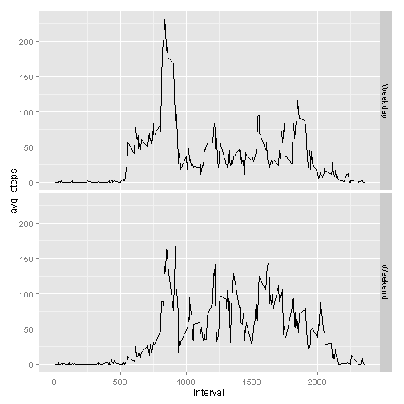

## Loading the data


```r
library(dplyr)
data <- read.csv("activity.csv")
```

## Mean total number of steps taken per day

Calculating steps per day, ignoring missing values

```r
summarized <- data %>% group_by(date) %>% summarise_each(funs(sum))
```

Histogram of total number of steps taken each day

```r
hist(summarized$steps)
```

 

Calculate and report the mean and median of total number of steps per day

```r
mean(summarized$steps, na.rm=TRUE)
```

```
## [1] 10766.19
```

```r
median(summarized$steps, na.rm=TRUE)
```

```
## [1] 10765
```

## Average daily activity pattern

Time series plot of 5-minute interval and average number of steps taken, averaged across all days.

```r
mean_steps<-data%>% group_by(interval)%>%select(steps)%>%summarise(avg_steps=mean(steps,na.rm=TRUE)) 
plot(mean_steps$interval, mean_steps$avg_steps, type="l")
```

 

5-minute interval containing the maximum number of steps

```r
mean_steps$interval[which((mean_steps$avg_steps)==max(mean_steps$avg_steps))]
```

```
## [1] 835
```

## Imputing Missing Values

Number of rows with NAs

```r
length(which(complete.cases(data)==FALSE))
```

```
## [1] 2304
```

The strategy used to fill in missing data, will be to replace each NA with the mean for that interval period.  New data set is created with missing data filled in.

```r
imputed_data<- left_join(data, mean_steps)
```

```
## Joining by: "interval"
```

```r
for(i in seq_along(imputed_data$steps)){
  if(is.na(imputed_data$steps[i])) {imputed_data$steps[i]<-imputed_data$avg_steps[i]}
  else {}
}
```

Histogram of steps taken each day, mean and median total number of steps taken per day.

```r
imp_data_sum<- imputed_data%>% group_by(date) %>% select(steps)%>% summarise(daily_sum=sum(steps))
hist(imp_data_sum$daily_sum)
```

 

```r
mean(imp_data_sum$daily_sum)
```

```
## [1] 10766.19
```

```r
median(imp_data_sum$daily_sum)
```

```
## [1] 10766.19
```

Imputing the missing data with the mean for each interval resulted in an increased number of days with the mean number of steps.  The values don't significantly differ from the estimates from the first part of the assignment, though the median now matches the mean.

## Differences in activity patterns between weekdays and weekends

Create factor variable indicating weekday or weekend

```r
imputed_data$dates<-as.Date(imputed_data$date, format = "%Y-%m-%d")
for(i in seq_along(imputed_data$dates)){
  if(weekdays(imputed_data$dates[i]) %in% c("Monday","Tuesday","Wednesday","Thursday","Friday"))
    {imputed_data$weekdays[i]<-"Weekday"}
  else {imputed_data$weekdays[i]<-"Weekend"}
}
```

Plot time series of 5-minute interval and avg number of steps taken, average across all weekday days or weekend days.

```r
library(ggplot2)
imp_mean_steps<-imputed_data%>% group_by(interval,weekdays)%>%
  select(steps)%>%summarise(avg_steps=mean(steps,na.rm=TRUE))
qplot(interval, avg_steps, data=imp_mean_steps, facets=weekdays~., geom="line")
```

 
